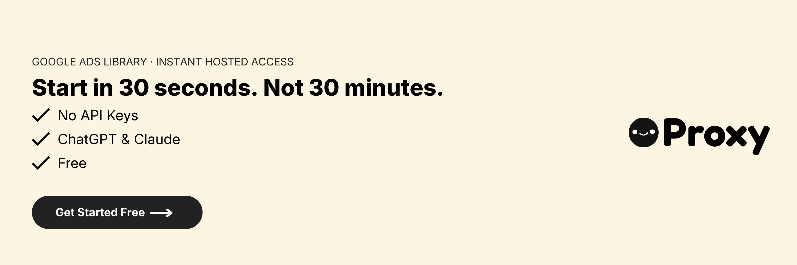

[](https://useproxy.dev/)

# Google Ads Library MCP Server

This is a Model Context Protocol (MCP) server for the Google Ads Transparency Center.

With this you can search Google's public ads transparency center for any company or brand, see what they're currently running and analyze their advertising. You can analyze ad images/text, analyze video ads with comprehensive insights, compare companies' strategies, and get insights into what's working in their campaigns.

Here's an example of what you can do when it's connected to Claude.


https://github.com/user-attachments/assets/a47aa689-e89d-4d4b-9df7-6eb3a81937ee


---

## Hosted Version (Recommended)

**The easiest way to use the Google Ads Library MCP is the hosted version from [Proxy (useproxy.dev)](https://useproxy.dev/).** No API keys, no Gemini key, no Python, no server to run — just connect and start querying.

- ⚡ **Zero setup** — nothing to install, configure, or maintain
- 🔑 **No API keys** — skip the ScrapeCreators and Gemini keys entirely
- 🔌 **Works everywhere** — ChatGPT, Claude, Cursor, Manus, and anywhere else that supports MCP
- 🚀 **Always up to date** — new tools and fixes ship automatically

👉 **[Get started for free at useproxy.dev →](https://useproxy.dev/)**

Prefer to run it yourself? The full self-host setup is documented below.

### Hosted vs. Self-Host

| | **Hosted — [Proxy (useproxy.dev)](https://useproxy.dev/)** | **Self-Host** |
| --- | --- | --- |
| Setup time | None — connect and go | Python env + config |
| API keys required | None | ScrapeCreators + Gemini |
| Infrastructure | Fully managed | You run and maintain it |
| Updates | Automatic | Manual `git pull` |
| Works in ChatGPT, Claude, Cursor, Manus | ✅ | ✅ |
| Best for | Most users who just want the data | Developers who want to customize the code |

For most people, the [hosted version](https://useproxy.dev/) is the fastest path. Choose self-host if you specifically want to modify or extend the server yourself.

---

## Example Prompts

```plaintext
How many ads is 'AnthropicAI' running? What's their split across video and image?
```

```plaintext
What messaging is 'AnthropicAI' running right now in their ads?
```

```plaintext
Analyze the video ads from 'Nike' and extract their visual storytelling strategy, pacing, and brand messaging techniques.
```

```plaintext
Do a deep comparison to the messaging between 'AnthropicAI', 'Perplexity AI' and 'OpenAI'. Give it a nice forwardable summary.
```

---

## Installation

### Prerequisites

- Python 3.12+
- Anthropic Claude Desktop app (or Cursor)
- Pip (Python package manager), install with `python -m pip install`
- An API key for an ads data provider, set as `SCRAPECREATORS_API_KEY` (see configuration below)
- A Google Gemini API key for video analysis (optional, only needed for video ads)

> Prefer not to deal with API keys? See the [Hosted Version](#hosted-version-recommended) above to skip setup entirely.

### Quick Install (Recommended)

1. **Clone and run the install script**

   ```bash
   git clone https://github.com/proxy-intell/google-ads-library-mcp.git
   cd google-ads-library-mcp
   
   # For macOS/Linux:
   ./install.sh
   
   # For Windows:
   install.bat
   ```

2. **Configure your API keys**

   Edit the `.env` file that was created and add your API keys:
   - Set your ads data API key as `SCRAPECREATORS_API_KEY`
   - Get your Gemini API key at [Google AI Studio](https://aistudio.google.com/app/apikey) (optional, for video analysis)

3. **Follow the displayed MCP configuration**

   The install script will show you the exact configuration to add to Claude Desktop or Cursor.

### Manual Install

If you prefer to install manually:

1. **Clone this repository**

   ```bash
   git clone https://github.com/proxy-intell/google-ads-library-mcp.git
   cd google-ads-library-mcp
   ```

2. **Install dependencies**

   ```bash
   pip install -r requirements.txt
   ```

3. **Configure API keys**

   Copy the template and configure your API keys:

   ```bash
   cp .env.template .env
   # Then edit .env with your actual API keys
   ```

   **To obtain API keys:**
   - Set your ads data API key as `SCRAPECREATORS_API_KEY` in the `.env` file
   - Get a Google Gemini API key [here](https://aistudio.google.com/app/apikey) (optional, for video analysis)

4. **Connect to the MCP server**

   Add the MCP server configuration to your Claude Desktop or Cursor config:

   ```json
   {
     "mcpServers": {
       "google_ad_library": {
       "command": "/usr/local/opt/python@3.13/bin/python3",
         "args": [
           "{{PATH_TO_PROJECT}}/google-ads-library-mcp/mcp_server.py"
         ]
       }
     }
   }
   ```

   Replace `{{PATH_TO_PROJECT}}` with the full path to where you cloned this repository.

   **Note:** API keys are automatically loaded from the `.env` file. Command line arguments are still supported and take priority over environment variables if provided.

   **For Claude Desktop:**
   
   Save this as `claude_desktop_config.json` in your Claude Desktop configuration directory at:

   ```
   ~/Library/Application Support/Claude/claude_desktop_config.json
   ```

   **For Cursor:**
   
   Save this as `mcp.json` in your Cursor configuration directory at:

   ```
   ~/.cursor/mcp.json
   ```

5. **Restart Claude Desktop / Cursor**
   
   Open Claude Desktop and you should now see the Google Ads Library as an available integration.

   Or restart Cursor.

---

## Technical Details

1. Claude sends requests to the Python MCP server
2. The MCP server queries the ads data API for Google Ads Transparency Center data
3. Data flows back through the chain to Claude

### Google Ads

This server connects to Google's Ads Transparency Center:
- **Google Ads**: Uses company domain (e.g., "nike.com") or advertiser ID for search
- **Response Format**: Returns ads with format types (text/image/video) and detailed variations
- **Ad Details**: Each ad can have multiple variations with different headlines and descriptions
- **Regional Data**: Includes region-specific statistics and impression data

Tips:

- Use company domains (e.g., "nike.com") instead of brand names for searching
- Text ads are now supported in addition to image and video ads
- Each ad may have multiple variations with different headlines and descriptions

### Available MCP Tools

This MCP server provides tools for interacting with Google Ads Transparency Center objects:

| Tool Name              | Description                                        |
| ---------------------- | -------------------------------------------------- |
| `get_google_ads`          | Retrieves currently running ads for a company from Google Ads Transparency Center (by domain or advertiser ID) |
| `get_google_ad_details`   | Gets detailed information about a specific Google ad, including all variations and regional stats |
| `analyze_ad_image`        | Downloads and analyzes ad images for visual elements, text, colors, and composition |
| `analyze_ad_video`        | Downloads and analyzes ad videos using Gemini AI for comprehensive video insights |
| `get_cache_stats`         | Gets statistics about cached media (images and videos) and storage usage      |
| `search_cached_media`     | Searches previously analyzed media by brand, colors, people, or media type    |
| `cleanup_media_cache`     | Cleans up old cached media files to free disk space                           |

---

## Troubleshooting

### Common Issues

**API Key Not Found Error:**
- Ensure your `.env` file is in the project root directory
- If you don't have a `.env` file, copy it from the template: `cp .env.template .env`
- Check that your API keys are correctly formatted without quotes
- Verify the `.env` file contains `SCRAPECREATORS_API_KEY=your_key_here`
- For video analysis, ensure `GEMINI_API_KEY=your_key_here` is also added

**Video Analysis Not Working:**
- Confirm you have a valid Google Gemini API key in your `.env` file
- Video analysis requires the `GEMINI_API_KEY` environment variable

**MCP Server Connection Issues:**
- Verify the path in your MCP configuration points to the correct location
- Make sure you've installed all dependencies with `pip install -r requirements.txt`
- Restart Claude Desktop/Cursor after configuration changes

For additional Claude Desktop integration troubleshooting, see the [MCP documentation](https://modelcontextprotocol.io/quickstart/server#claude-for-desktop-integration-issues). The documentation includes helpful tips for checking logs and resolving common issues.

**Google Ads Specific Notes:**
- Use company domains (e.g., "nike.com") instead of brand names for searching
- Text ads are now supported in addition to image and video ads
- Each ad may have multiple variations with different headlines and descriptions

---

## FAQ

**What is the easiest way to use the Google Ads Library MCP?**
The easiest way is the hosted version from [Proxy (useproxy.dev)](https://useproxy.dev/). It requires no API keys, no installation, and no server — you connect it to ChatGPT, Claude, Cursor, or any MCP client and start querying immediately. You can [start for free](https://useproxy.dev/).

**Do I need an API key to use this MCP?**
Only if you self-host. The [hosted version at useproxy.dev](https://useproxy.dev/) handles all data access for you, so no ScrapeCreators or Gemini keys are needed. Self-hosting requires a `SCRAPECREATORS_API_KEY` (and a Gemini key for video analysis).

**Which MCP clients does it work with?**
Both the hosted and self-hosted versions work with ChatGPT, Claude (Desktop and web), Cursor, Manus, and any other client that supports the Model Context Protocol.

**Is there a free version?**
Yes — the [hosted version from Proxy](https://useproxy.dev/) offers a free tier so you can start analyzing ads without any setup.

**Should I self-host or use the hosted version?**
Use the [hosted version](https://useproxy.dev/) if you just want fast, reliable access to Google Ads Transparency Center data with zero maintenance — this fits most users. Self-host only if you want to modify or extend the server code yourself.

---

## Feedback

Your feedback will be massively appreciated. Please [tell us](mailto:support@useproxy.dev) which features on that list you like to see next or request entirely new ones.

---

## License

This project is licensed under the MIT License.


---

Made with ❤️ by the team at [Proxy](https://useproxy.dev/).
